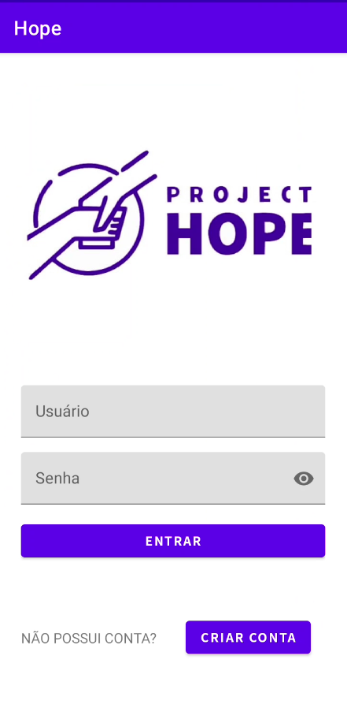
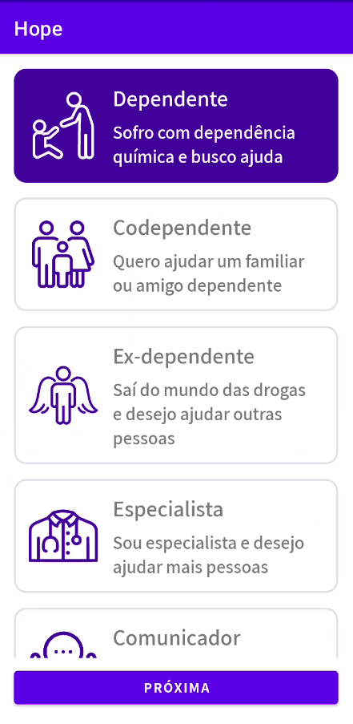
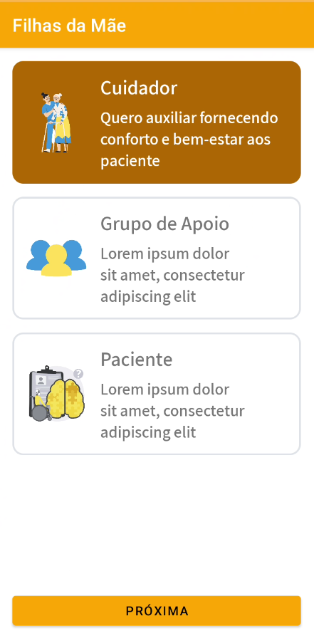
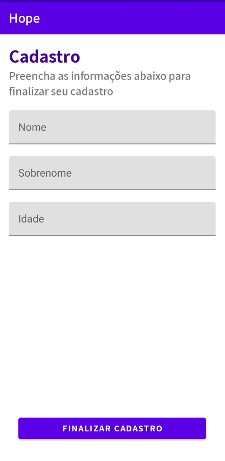
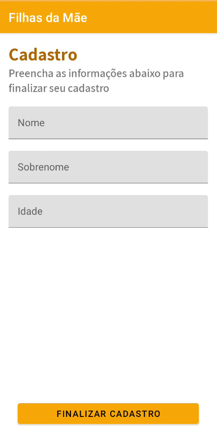
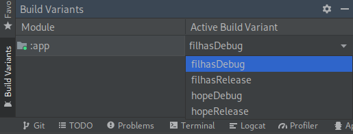

# hope-flavors

 

 

 

Esta é uma prova de conceito utilizada para validar o uso de  a fim de desenvolver uma rede de cuidado genérica, promovendo o reuso de código entre aplicações com requisitos específicos. Nesse exemplo utilizamos o Hope, que tem como intuito apoiar pessoas que sofrem de dependência química, e o Filhas da Mãe, que foca em idosos e pessoas que sofrem de Alzheimer.

Para escolher entre buildar o Hope ou o Filhas da Mãe, deve-se selecionar a build variant correspondente.

